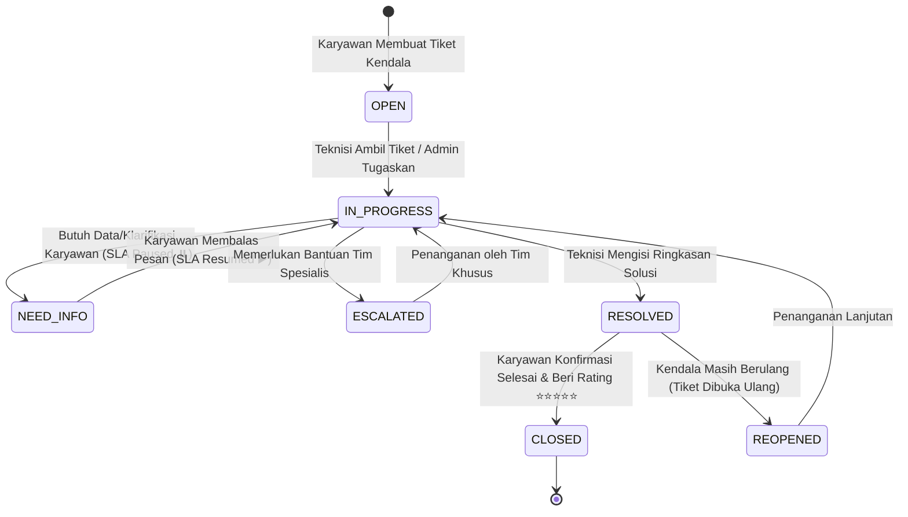

<div align="center">

# 🎫 PlisHelp
### Enterprise IT Helpdesk & Service Management System

**Solusi Manajemen Layanan IT Internal Berbasis Standar ITIL untuk Menghilangkan Hambatan Operasional, Meningkatkan Akuntabilitas, dan Memaksimalkan Efisiensi Kerja Perusahaan.**

[](https://nextjs.org/)
[](https://react.dev/)
[](https://www.typescriptlang.org/)
[](https://laravel.com/)
[](https://www.postgresql.org/)
[](https://tailwindcss.com/)

</div>

---

## 💡 Permasalahan Nyata yang Dijawab oleh PlisHelp

Di banyak perusahaan, pengelolaan kendala teknologi informasi (*hardware*, *software*, jaringan, dan akun sistem) masih mengandalkan pesan instan (*WhatsApp/Telegram*) atau percakapan lisan. Praktik ini memicu berbagai kerugian operasional dan inefisiensi bisnis:

| Tantangan Operasional Tradisional | Solusi Terpadu yang Dihadirkan PlisHelp |
| :--- | :--- |
| **Pesan Kendala Tertumpuk & Terabaikan**<br>Permintaan bantuan via chat sering tenggelam, tidak tercatat, dan tidak memiliki penanggung jawab yang jelas. | **Single Source of Truth (Satu Portal Terpusat)**<br>Seluruh permohonan tervalidasi ke dalam tiket resmi dengan nomor unik, prioritas, dan riwayat status yang transparan. |
| **Tidak Ada Kepastian Waktu Selesai**<br>Karyawan tidak tahu kapan masalahnya akan selesai, memicu frustrasi dan terganggunya produktivitas kerja. | **Dynamic ITIL SLA Engine (Target Waktu Terukur)**<br>Penetapan Service Level Agreement (SLA) otomatis berdasarkan tingkat keparahan (*Low, Medium, High, Urgent*). |
| **Beban Kerja Tim IT Tidak Merata**<br>Sebagian teknisi kelebihan beban kerja (*overload*), sementara tiket lain tidak ada yang menangani (*idle*). | **Open Queue & Smart Assignment System**<br>Antrean tiket terbuka yang adil untuk diklaim mandiri oleh teknisi (*Take Ticket*) atau didelegasikan langsung oleh Admin. |
| **Kebocoran Informasi Log Teknis**<br>Karyawan bingung atau cemas melihat istilah troubleshooting internal tim IT yang terlalu teknis. | **Dual-Channel Communication (Publik vs Internal)**<br>Pemisahan pesan komunikasi publik untuk pengguna dan *Internal Notes* khusus kolaborasi rahasia sesama teknisi IT. |
| **Tidak Ada Metrik Evaluasi Layanan**<br>Manajemen tidak memiliki data objektif untuk menilai performa IT Support dan tingkat kepuasan karyawan. | **Real-Time Analytics & CSAT Rating**<br>Dashboard analitik kepatuhan SLA, durasi resolusi, serta ulasan kepuasan bintang 1-5 dari karyawan. |

---

## ✨ 5 Nilai Jual & Keunggulan Utama (*Core Value Proposition*)

### 1. ⏱️ Intelligent SLA Tracking & Auto-Pause Engine
* **Perhitungan SLA Akurat**: Menghitung mundur batas waktu respon pertama (*First Response*) dan batas waktu penyelesaian (*Resolution Target*).
* **Fitur Auto-Pause Status `NEED_INFO`**: Ketika teknisi membutuhkan data tambahan dari karyawan, penghitungan SLA otomatis dihentikan sementara (*paused*) agar performa metrik tim IT tetap adil dan tidak terpotong oleh waktu tunggu respon karyawan.
* **Indikator Visual Proaktif**: Status SLA berkode warna (*On Track*, *At Risk*, *Breached*) memberi sinyal peringatan dini sebelum batas waktu terlampaui.

### 2. 👥 Alur Kerja Multi-Role yang Terstruktur & Akuntabel (RBAC)
* **Karyawan (*Requester*)**: Pengalaman pengajuan bantuan yang mudah, transparan, dan dapat memantau progres secara *real-time*.
* **Teknisi IT (*Resolver*)**: Ruang kerja fokus tanpa distraksi dengan antrean tugas pribadi, catatan internal, dan fitur eskalasi kendala.
* **IT Administrator (*Manager*)**: Pengawasan menyeluruh atas seluruh siklus operasional, tata kelola departemen, kategori masalah, dan kebijakan SLA perusahaan.

### 3. 💬 Dual-Channel Collaborative Workspace
* **Komentar Publik**: Menjembatani komunikasi formal antara pembuat tiket dan teknisi resolver.
* **Catatan Troubleshooting Internal (*Private IT Notes*)**: Tempat teknisi mencatat diagnosa teknis, konfigurasi router, log error server, atau diskusi internal yang tersembunyi sepenuhnya dari pemohon tiket.

### 4. 🔒 Tata Kelola Pengguna & Fleksibilitas Keamanan Akun
* **Kustomisasi Kata Sandi Bebas**: Administrator memiliki keleluasaan penuh menentukan kata sandi untuk pengguna baru sesuai kebijakan keamanan perusahaan.
* **Fitur Reset Password Mandiri oleh Admin**: Solusi cepat ketika ada karyawan atau staf yang lupa kata sandi tanpa birokrasi yang rumit.
* **Proteksi Akses Seketika**: Kemampuan menonaktifkan akun karyawan yang sedang cuti panjang atau *offboarding* secara instan.

### 5. 🎨 Antarmuka Ultra-Modern, Cepat, & Responsif
* Mengusung gaya visual *Glassmorphic Dark Aesthetic* dengan kontras tinggi yang nyaman di mata untuk penggunaan jangka panjang.
* Dilengkapi *micro-animations* dan *instant feedback toast* untuk menghadirkan pengalaman pengguna (*User Experience*) setara aplikasi enterprise kelas dunia.

---

## 🎯 Peran Pengguna & Solusi Spesifik yang Didapatkan

```
+---------------------------------------------------------------------------------------------------+
|                                       PLISHELP WORKSPACE                                          |
+------------------------------+------------------------------------+-------------------------------+
| 👤 EMPLOYEE (Requester)      | 🎧 IT SUPPORT (Resolver)           | 🛡️ IT ADMIN (Super Admin)     |
+------------------------------+------------------------------------+-------------------------------+
| • Mengajukan permohonan baru | • Mengambil tiket antrean terbuka  | • Dashboard analytics eksekutif|
| • Melampirkan berkas bukti   | • Penanganan antrean personal      | • Distribusi & penugasan staf |
| • Diskusi pesan publik       | • Catatan troubleshooting internal | • Kustomisasi & reset password|
| • Konfirmasi selesai         | • Minta info tambahan (Pause SLA)  | • Kelola taksonomi kategori   |
| • Rating kepuasan & ulasan   | • Eskalasi kendala kompleks        | • Kelola kebijakan durasi SLA |
| • Buka ulang tiket bermasalah| • Mengisi ringkasan solusi         | • Koreksi status darurat      |
+------------------------------+------------------------------------+-------------------------------+
```

### 👤 1. Karyawan (Employee) — *Fokus: Kemudahan & Transparansi*
* **Daya Tarik**: Karyawan tidak perlu lagi bingung mencari siapa teknisi yang sedang bertugas. Cukup buat tiket, sistem akan mengurus distribusi penugasan dan memberikan kepastian penyelesaian.
* **Dampak**: Waktu terbuang akibat kendala teknis dapat ditekan seminimal mungkin (*minimized downtime*), sehingga karyawan bisa kembali fokus pada pekerjaan utamanya.

### 🎧 2. Teknisi IT (IT Support) — *Fokus: Efisiensi & Prioritas Kerja*
* **Daya Tarik**: Menghilangkan komplain tumpang tindih. Teknisi dapat memilah tiket berdasarkan tingkat urgensi tertinggi dan batas SLA terdekat.
* **Dampak**: Produktivitas tim IT meningkat tajam karena alur kerja tersusun rapi dari status `OPEN` hingga `RESOLVED`.

### 🛡️ 3. Administrator / Manajemen — *Fokus: Pengawasan & Pengambilan Keputusan*
* **Daya Tarik**: Visibilitas penuh terhadap performa departemen IT. Mengetahui jenis kendala apa yang paling sering terjadi (misal: koneksi jaringan, kerusakan printer, lisensi software) dan persentase kepatuhan SLA tim.
* **Dampak**: Manajemen memiliki dasar data yang kuat untuk peremajaan aset IT, penambahan staf, atau pelatihan internal karyawan.

---

## 🔄 Siklus Hidup & State Machine Tiket Berstandar ITIL

Setiap tiket melewati alur kerja formal dengan integritas data yang terjamin:



---

## 🛠️ Tumpukan Teknologi (*Technology Stack*)

PlisHelp dibangun menggunakan fondasi teknologi modern untuk menjamin kecepatan, skalabilitas, dan keandalan tinggi:

* **Frontend Engine**: **Next.js 16 (App Router)** & **React 19** — Rendering kilat berbasis arsitektur komponen modular dan performa kompilasi Turbopack.
* **Bahasa & Type Safety**: **TypeScript 5** — Menghilangkan potensi bug runtime dan menjamin integritas kontrak data dari frontend ke backend.
* **Desain & Antarmuka**: **Tailwind CSS 3.4** — Tata letak responsif, palet warna elegan bertema gelap (*Dark Theme*), dan ikonografi modern dari **Lucide React**.
* **Backend RESTful API**: **Laravel 13** — Framework PHP modern dengan arsitektur *Service-Repository Pattern*, *Form Request Validation*, dan *Transaction-safe Workflow Services*.
* **Sistem Autentikasi**: **Laravel Sanctum** — Keamanan sesi berbasis *Bearer Token API* yang aman dan ringan.
* **Basis Data Relasional**: **PostgreSQL 18** — Mesin database enterprise dengan dukungan *UUID indexing*, relasi *Foreign Key* berintegritas tinggi, dan penyimpanan riwayat audit *JSONB*.

---

## 🏆 Mengapa PlisHelp Pilihan Terbaik untuk Perusahaan Anda?

1. **Siap Pakai untuk Lingkungan Korporat**: Struktur data departemen, kategori bertingkat, dan kebijakan SLA yang dapat disesuaikan dengan SOP perusahaan mana pun.
2. **Audit Trail Lengkap (*Compliance Ready*)**: Setiap perubahan status, penugasan teknisi, komentar, hingga eskalasi terekam permanen dalam log riwayat aktivitas.
3. **Menghemat Waktu & Anggaran**: Mengurangi beban komunikasi repetitif dan mempercepat waktu penyelesaian kendala IT secara terukur.
4. **Berorientasi Kepuasan Pengguna**: Fitur penilaian bintang dan ulasan memastikan standar kualitas layanan IT selalu terjaga pada tingkat tertinggi.

---

<div align="center">

**PlisHelp — Menghubungkan Kebutuhan Karyawan dengan Solusi IT yang Cepat, Tepat, dan Terukur.**

</div>
